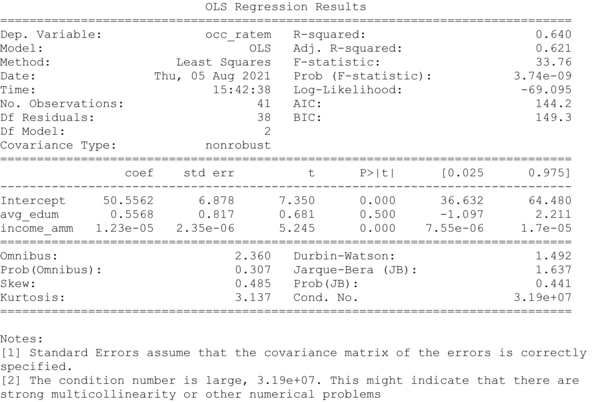

# Multiple Linear Regression

## Incidence of education and income level on labor force participation

### 1. Model 1: specification
#### 1.1 Empirical basis
h1 = Positive relationship of the educational level, the higher the educational level, the greater the possibility of being part of the economically active population in the labor market.

h2 = Positive relationship of income level, indicating that the higher the income level there is a greater possibility of being part of the economically active population in the labor market.

#### 1.2 Variables

	“periodicity”, quarterly.
	“occ_ratem”, independent variable: quarterly occupancy rate.
	“avg_edu”, average employed population according to educational level. 
	“income_am”, average monthly labor income.
  
### 2. Exploratory Data Analysis
| periodicity | avg_edum | income_amm | occ_ratem | avg_eduf | income_amf |occ_ratef | 
|-------------| ------------- | ------------- | ------------- | ------------- | ------------- | ------------- |
| 20071 | 9.79  | 736535  | 63.6  | 10.34  | 612212  | 37.4  |
| 20072 | 10.02  | 781119  | 65.0  | 10.42  | 638328  | 38.8  |

#### 2.1 Correlation Matrix

<p align="center">
  
</p>

#### 2.2 Dispersion and Normal Distribution

<p align="center">
  
</p>

### 3. Fitted Model
#### Using Scikit-learn

The first model corresponding to the female case is defined as follows  
```
	occ_ratef ~ avg_eduf + income_amf
	𝑜𝑐𝑢𝑝𝑎𝑡𝑖𝑜𝑛𝑟𝑎𝑛𝑔𝑒𝑓 = 79.11 − 6.13∗𝑎𝑣𝑔𝑒𝑑𝑢𝑚 + 0.000040∗𝑖𝑛𝑐𝑜𝑚𝑒𝑎𝑚𝑚
```

<p align="center">
  
</p>

#### Using Statsmodels
The model with all the dependent variables introduced as predictors has a high R2 (0.71), which is why it's capable of explaining 71% of the variability of the occupancy rate. One of the partial regression coefficients is not significant, which is an indication that it might not contribute to the model and indicates a possible multicollinearity condition

<p align="center">
  
</p>

### 4. Verifying the assumptions
####  Linearity and Homoscedasticy

The inspection of the plots shows that the linearity assumption is satisfied. The homoscedasticity graph shows random residuals with a slight pattern that can be considered as a sign of non-constant variance, that is, of heteroscedasticity, therefore the Breush Pagan Test is applied. According to this test p-value obtains a value of 0.06 higher than the significance level of 0.05.

<p align="center">
  
</p>

####  Normality
The variables are distributed in a normal way, this is corroborated through the Q-Q plot and according to the null hypothesis of the Shapiro-Wilk test.

<p align="center">
  
</p>

#### No Multicollinearity
The variance inflation factor statistical method is used for the data of model 1, it is possible to observe that the VIF have a value greater than 5, which is indicated by a potentially severe correlation between a given explanatory variable and other explanatory variables in the model. In this case, the estimates of the coefficients and p-values in the regression result are probably not reliable.

```
              VIF	  variable
0    12449.142053	 Intercept
1	10.803469	  avg_eduf
2	10.803469	income_amf

```
#### No Autocorrelation
The p-value and Durbin-Watson statistic allow us to observe that ɖ falls in the indecision zone (1.17), so it's not possible to affirm the presence of autocorrelation or discard its existence, this may indicate that there is no first-order autocorrelation, but second order. The Breusch Godfrey test is applied, since p-value = 0.00139 there is second order  autocorrelation.

###  Model 2: specification
### 1. Exploratory Data Analysis
#### 1.1 Correlation Matrix

<p align="center">
  
</p>

#### 2.2 Dispersion and Normal Distribution
Although the values are normally distributed, the presence of an unusual value can be visualized.
<p align="center">
  
</p>

### 3. Fitted Model
#### Using Scikit-learn

The second model corresponding to the male case is defined as follows  
```
	occ_ratem ~ avg_edum + income_amm
	𝑜𝑐𝑢𝑝𝑎𝑡𝑖𝑜𝑛𝑟𝑎𝑛𝑔𝑒𝑚=50.55+0.55∗𝑎𝑣𝑔𝑒𝑑𝑢𝑚+0.000012∗𝑖𝑛𝑐𝑜𝑚𝑒𝑎𝑚𝑚
```

<p align="center">
  
</p>

#### Using Statsmodels
The model with all the dependent variables introduced as predictors has a medium-high R2 (0.64), which is why it's capable of explaining 64% of the variability of the occupancy rate. As in the previous model, the summary indicates possible multicollinearity problems.

<p align="center">
  
</p>

### 3. Outlier Identification
The presence of an unusual value is verified for the period 2008-3.

<p align="center">
  
</p>

### 4. Verifying the assumptions
####  Linearity and Homoscedasticy

The inspection of the plots shows that the linearity assumption is satisfied. The homoscedasticity graph shows random residuals with a slight pattern that can be considered as a sign of non-constant variance, that is, of heteroscedasticity, therefore the Breush Pagan Test is applied. According to this test p-value obtains a value of 0.68 higher than the significance level of 0.05.

<p align="center">
  
</p>

####  Normality
The variables are distributed in a normal way, this is corroborated through the Q-Q plot and according to the null hypothesis of the Shapiro-Wilk test.

<p align="center">
  
</p>

#### No Multicollinearity
The variance inflation factor statistical method is used for the data of model 1, it is possible to observe that the VIF have a value greater than 5, which is indicated by a potentially severe correlation between a given explanatory variable and other explanatory variables in the model. In this case, the estimates of the coefficients and p-values in the regression result are probably not reliable.

```
              VIF	  variable
0     1055.385145	 Intercept
1	 2.041067	  avg_edum
2	 2.041067	income_amm

```
#### No Autocorrelation
The p-value and Durbin-Watson statistic allow us to observe that ɖ falls in 1.49 with a p-value of 0.054, it's not possible to reject the null hypothesis. The Breusch Godfrey test is applied, since p-value = 0.059 there is evidence of autocorrelation.

